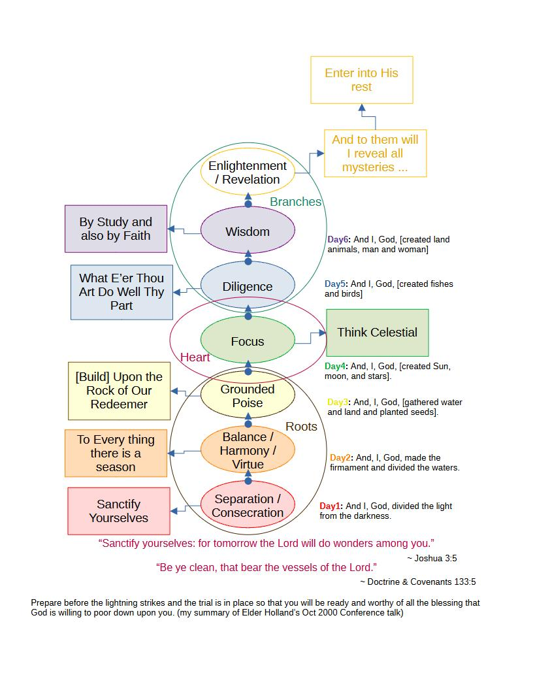

# The Tower I Am

So I call this “The Tower I Am” with reference to the “I Am” that is one of the names of God, 
and also following somewhat the esoteric traditions of the Kabbalistic Tree of Life, that transforms 
the creation story into a path of understanding and gaining access to God and His power. The idea being that there 
are hidden truths found in the Bible to unlocking ones divine connection with the Heavens, and 
achieving the miraculous.  I hope to use this "tower" as a core to a mind map (or several mind maps) to help 
me with all learning, my hypothesis being that studying eternal truths from the top (most important) down will help in 
the study of all things. In a way this is like my Jacob’s Ladder or stairway to heaven (or at least as 
scaffolding or backbone for creating it for myself--believing that everyone should do something like this for themselves), 
and in building and climbing it I can find my way to God (and what I am meant to become) – the main distinction from the Tower of 
Babel being that I expect and rely on help from God at every step of the journey. I use the words “I Am” because I love 
how inviting all of the words of Christ are, being “The Way” and telling us to "be ye therefore perfect, 
even as your Father which is in heaven is perfect" (Matthew 5:48). The invitation being very clear that 
we are to become as much like God as we can, following His perfect example. Even the words he used to introduce himself
in the New Testament were words that can and should be used by any and all. So I think that constructing 
this Tower I Am is exactly what we need to be explicitly doing, and getting and giving as much help as 
we can to each other along the way.
 
 
My first favorite scripture that I encountered on my own was Abraham 1:2 paraphrased as: Abraham wanted to be like 
the great people that preceded him, desiring to “posses great knowledge, and to be a greater follower of righteousness, 
and possess a greater knowledge”. The path to this end is trying to accumulate as many virtues as I can and eliminate 
as many vices as possible, and continue that process well into the eternities, emulating where we can the greatness that we find
in other to help us obtain greatness for ourselves. Yet, virtues are hard to accumulate and vices 
are hard to part with. So with the mind maps and study necessary to create them, I want to also come up with better 
challenges, metrics, and goals to make sure I’m really moving forward. I want to accumulate and internalize (optimize) as 
may tools and skills as I can that can help me press forward in this endevor.
 
 
I love how the first examples of revelation in the Book of Mormon are of people hearing something from other people and then
going to God to find out on their own, for themselves, if it is true or not. And so I created this framework for me to help
me as I read and study since it looked like that is what the Kabbalah was created for (at a time when that kind of stuff might 
have been considered heresy and needed to be kept in the dark). While all of these lessons I am creating here are
mostly for myself. I picked the creation story for the frame work and my own set of "steps" for each day because I liked that
idea from the Kabbalistic mysticism and it seemed like one of the only ways for me to make any real sense of the creation story
that had the sun, moon and stars created in the middle after there were plants growing on the earth in that story, but I 
think that the real power of using this as a personal path of creation from chaos to divine comes from the work and study that goes into 
creating it for oneself. I'm not using the same steps or words from the Kabbalah, nor any Indian or other tradition that might have 
also adopted the "magic" number 7. -- That number didn't fit as well when it was applied to the rainbow, six works better there with 
thee primary and three secondary colors, and those 6 worked better for me here in my six days of creation. ... So for anyone who
may follow along, I think your free to pick any number or framework that you like and start from there. Think of steps that have worked
or that you think might work and build from there.
