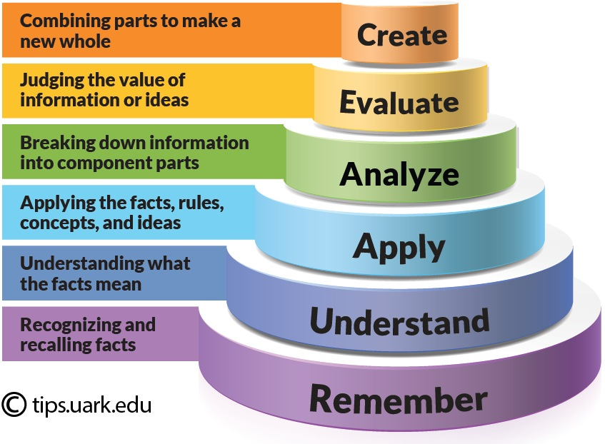

## The ultimate in learning and teaching
#### Transcript (with notes):
Let me start by sharing with you a conversation I had with my mother a little while ago. She suggested that I need a haircut, 
but I told her I couldn’t because I was going to be speaking here soon about teaching in the Savior’s way, and I wanted to look 
as much like Him as I could so that you wouldn’t have to squint so hard to image that it was Him here before you instead of me.

So how do I look? Can you imagine the smile that he’d have just seeing you? Perhaps also the tears of joy in his eyes? Arms wide open wide open 
ready to embrace you? If he were here wouldn’t he bend time and space so that he could spend time with you individually and let you know how much he loves YOU!

For the past while I’ve been spending my personal time learning about learning and self-improvement(this github and the eventual website and apps), 
and I came across Bloom’s Taxonomy of learning and education . It’s a pyramid of techniques, at the base of which is what we can remember. Then what we 
understand and then what we can apply. Above that is how well we can analyze the information we remember, understand, and apply. Next is how well we 
make it our own, critique it, connect it and mix it. And then we get to the genius level of creation that changes the world. This taxonomy has been around
for longer than I’ve been alive, but it was originally thought that you have to build this pyramid from the ground up and it was only taught to evaluators
so that they could create questions to figure out what level the students have reached. But it turns out that if you have the end goal in mind, it makes
it a lot easier to go through all of the steps to get there, and it’s a lot easier to remember, understand, apply, analyze, and connect those things that
are life changing.

So let’s walk through this really quickly with the sacrament. It’s fairly easy to remember the elements: bread, wine, priesthood, and the savior’s sacrifice. 
To understand is the next step up. Then apply, we take the sacrament. All of these steps are fairly easy and straightforward, it’s the next levels that 
require more of us. Connecting, taking on the savior’s name, and repentance, finding those ways we can--that we need to--be more like Him and with Him 
change the world. And look at that, here at the top level with you thinking of how you can change the world you’re thinking like a genius. 

One of the ways that I’ve tried to apply this to my gospel study is by asking the question: which of the recent general conference talks have changed 
my life forever? As far as the [April conference](https://www.churchofjesuschrist.org/study/general-conference/2025/04?lang=eng) goes, I don’t know,
I’m still working on it. But not too long ago [Elder Holland](https://www.churchofjesuschrist.org/study/general-conference/2024/04/13holland?lang=eng)
gave a very personal, very emotional talk about dying (or at least almost dying) and there at the edge of eternity having a powerful personal experience 
encouraging him to do and be more. Much like his examples of it being hard to imagine Jesus, being perfect, praying “more earnestly” it’s hard for me to 
imagine an apostle of Christ needing to do more or be more diligent.  But I have since that time learned better how to have those edge of eternity experiences 
myself (without dying or almost dying). Because that’s the temple experience of talking with God at the veil of existence, moments when we almost can't 
help but feel God's presence and love. 

The temple endowment presentation is a symbolic representation of the all of everything that God gives us--endowment meaning gift. The first and 
foremost of that gift is love and is represented throughout the endowment, which starts before we were born. He loves us so much he provides everything: 
air to breathe water to sustain life. He loves us so much he goes infinitely beyond just giving us enough to survive but rather enough to thrive. 
Consider the infinite detail in just a grain of sand, we’d need PhDs in physics, mathematics, geology, microbiology, and such just to begin to 
appreciate the level of detail he has put into making your life magical. The sun, the moon, and stars; harmonies, music, and stories; and so much 
more to inspire, encourage, and lift us. But his love doesn’t end there with just the creation, before we were born, and the endowment goes on to 
represent our lives and opportunities to grow. And growing is tough and embarrassing. We might want to hide from each other and from God, and put 
on airs and with smoke and mirrors pretend that we’re more than the train wreck of a mess that we are. But God finds us even here, where we might feel 
isolated and alone, and He brings us back and sets us on the path to learn and grow. Sometimes on this path we’re the ones He sends to others, as messangers,
like me here today trying to fill His enormous shoes in talking with you. The endowment ultimately leads us to the end, the edge of eternity where we meet 
with God and he puts his arm around us and we put ours around him and he asks do you know what the key is to life, what it takes to enter heaven. And we
answer back “No, I'm still working on that, that’s what I’m here to ask you about.” And though you can’t see him because he’s on the other side
of the veil you can feel his smile as he says “the key is that I love you more than you can possibly imagine.”

So here at the edge of eternity as you feel the savior’s infinite love for you? Do you understand what He’s trying to say to you directly, so that you 
and I can live closer to heaven in our daily lives? Can you feel the urgency to be so much more than we are? I want to be like Him. I want to help him 
to help you to see the way forward. I want to take part in being a savior on Mt. Zion. This, then, is one element of genius that won’t be found in secular 
models, revelation: our ability to hear, recognize, understand, and follow His voice as He tries to guide us. 

So how have I done? Did you hear the savior’s voice? Can you feel His love? Did I successfully bring the temple and more importantly the heaven it 
represents here? Can you confidently see the end goal? Did you find your own genius ability in figuring out how you can use this knowledge to change 
your life and change the world, at the very least one person at a time? Then I can confidently and courageously say: in the name of that Jesus Christ 
who we love and adore, Amen. 

